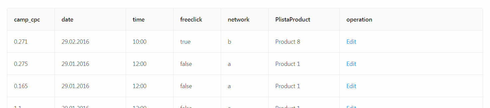

# EditableTable-react

Editable table with react and [ant-design](https://ant.design/).


## Table of Contents

- [Preview](<(#preview)>)
- [Installation](#installation)
- [Support](#support)

## Preview

URL: https://editabletable-react.netlify.com

## Installation

```sh
git clone https://github.com/antekai/ct-pl-editableTable-react.git editableTable-react
cd editableTable-react
yarn install
yarn start
```

## Features

- Raw data preprocess and render to a table
- Edit and save per record(row): checkbox, select, datePicker, timePicker, radio input for respective data type
- State management: Local, Context API (react)
- UI-kit: [ant-design](https://ant.design/)
- Boostrapping: create-react-app, react-app-rewired
- Netlify CD

## Support

Please [open an issue](https://github.com/antekai/ct-pl-editableTable-react/issues/new) for support.
